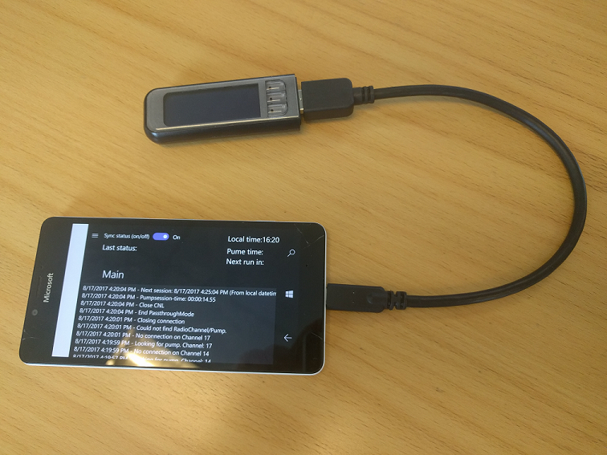
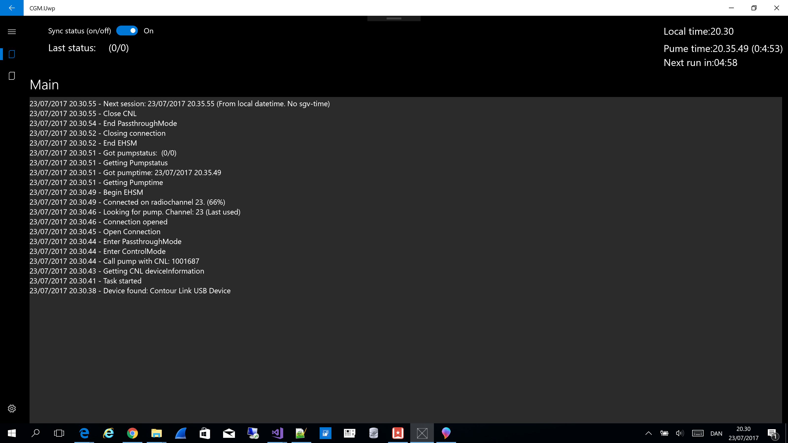
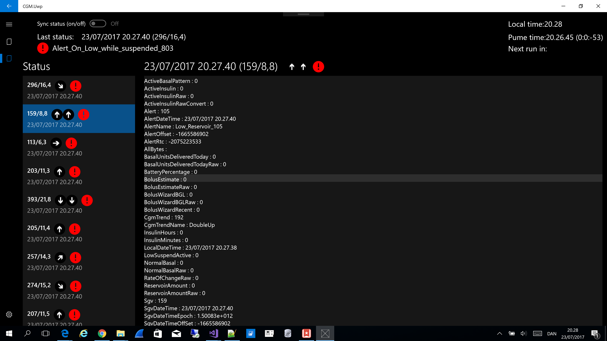
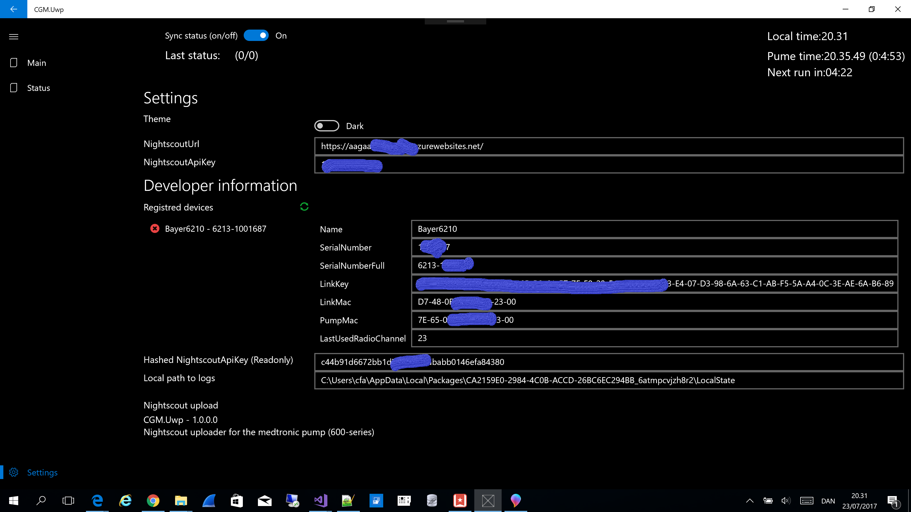

# Introduction
Beta version of uploader for the 600-series pump.

#### Status

Been running 24/7 on Raspberry PI 3 with Windows Iot (v.10.0.15063.540) since 13-08-2017.

Testing sending pump-events (history) as JSON to a [Microsoft Flow](http://flow.microsoft.com) in order to send notifications and create tasks in a [wunderlist](http://www.wunderlist.com) todo-list (when to change sensor/cannula).

Testing application on a old Microsoft Lumia 950 mobile phone. (17-08-2017). Looks good so fare.

known issues:

Getting some errors when reading history, but not always.....

## Projects
CGM.Communication: The core communication between pump and CNL. Coded in c# [.NET standard 1.4](https://docs.microsoft.com/en-us/dotnet/standard/net-standard). 

CGM.Uwp: The client. Coded for UWP.  Using the "Windows Template studio" with MVVM light. Support scenario: Always online and always power.

All tested on a laptop with windows 10 and a raspberry pi 3 with windows iot. 
The Raspberry Pie 3 sits on the bedside table and runs 24/7 and  "catches" the pump whenever in range.

TODO projects:
- Android Xamarin (uploader using CGM.Communication logic that runs on a Android phone. Great for mobile, but limited power (under a day) and the size is "not optimal" as my kid points out... :-) )
- .NET Core (just a proof-of-concept that it can run on Linux. Why? Because you can :-)... maybe.... )
- Scenario: Mobil: Almost always online and limited power. -> Developer module that can code generate  sketch-scripts for the arduino. (Is Ardunio the right platform??)
Tested this scenario with a Raspberry pie 3 and a battery pack of 20000mAh. It lasted for almost 24 hours.

### If you want to use it
1. Download [visual studio community 2017 ](https://www.visualstudio.com/downloads/).
2. Build and deploy uwp-project and then debug it

In order to run the uploader you need to go the settings page and configure your nightscout url/api-key.
It also on the settings page that you can see the registred CNL and their parameters.
You can delete the CNL from here.

I have used Microsoft.Extensions.Logging for the logs. You can see the placement of the logs in the setting page.
I did not want to make too many external reference. So there is no reference to Microsoft Azure Services ex. insight, iot hub, power bi and so on..

But I plan to make use of those services in the near future.

Some screenshots:
You can start and stop the CNL/uploader at the top, where you also can see the latest status.

If you click on the status-icon to the left (or expand the hamburger menu) then you have the status screen (Showing test-data right now :-) ):

At the bottom you have the settings-screen. I have "blued" out my settings. 

# Standing on the shoulders of giants....
A big thanks goes out to the Nightscout community who without this project would not have been possible.
Not sure if it is good manners to single out persons.... but here goes:

Thanks goes out to Lennart Goedhart (https://github.com/pazaan) for the uploader and decoding work.

Thanks to the 600Series team https://github.com/pazaan/600SeriesAndroidUploader  

Figuring out and using the protocol would not have been possible without the work of these guys/girls.

### Disclaimer And Warning
All information, thought, and code described here is intended for informational and educational purposes only. 
Nightscout currently makes no attempt at HIPAA privacy compliance. 
Use Nightscout at your own risk, and do not use the information or code to make medical decisions.

Use of code from github.com is without warranty or formal support of any kind. Please review this repository's LICENSE for details.

All product and company names, trademarks, servicemarks, registered trademarks, and registered servicemarks are the property of their respective holders. Their use is for information purposes and does not imply any affiliation with or endorsement by them.

Please note - this project has no association with and is not endorsed by:

Medtronic

Ascensia Diabetes Care (formerly Bayer Diabetes Care)
